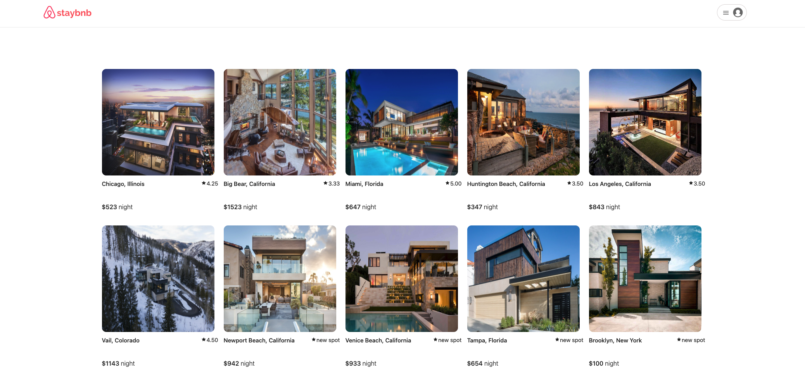
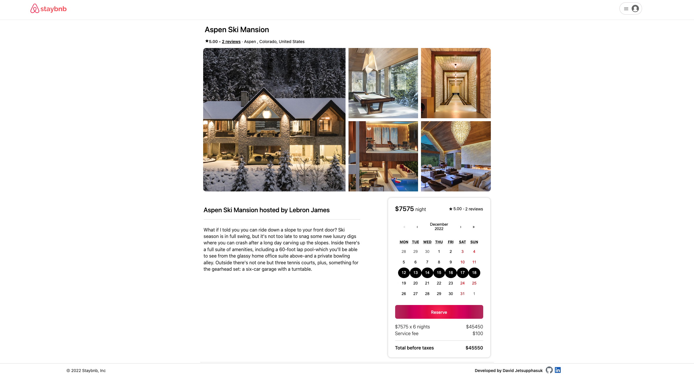
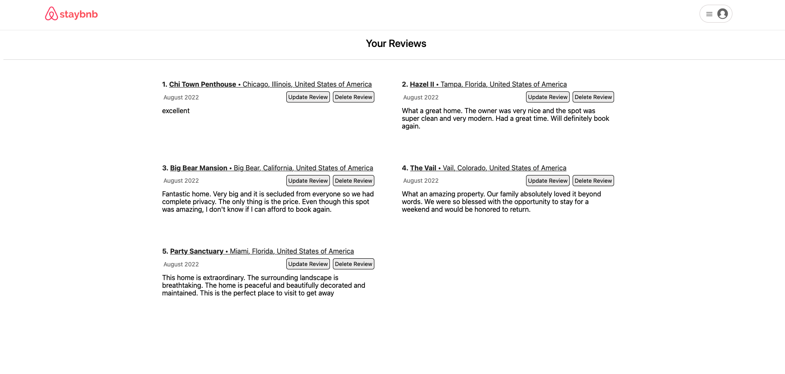

# Staybnb

Welcome to Staybnb, a clone of Airbnb.

This project was created using Express, Sequelize, and SqLite for the backend and React, Redux for the frontend.

## About the Project

[API Documentation](https://github.com/davidjettt/Airbnb-clone/wiki/API-Documentation)

[Database Schema](https://github.com/davidjettt/Airbnb-clone/raw/master/backend/airbnb-clone-db-schema-3.png)

[Features List](https://github.com/davidjettt/Airbnb-clone/wiki/Features-List)

[Redux State Shape](https://github.com/davidjettt/Airbnb-clone/wiki/Redux-State-Shape)


## Home Page


## Spot Details


## User Reviews


## How to Launch Project

To launch project locally:
- `cd` into the backend folder.
- Create a `.env` file with environment variables:
    ```
    PORT=8000
    DB_FILE=db/dev.db
    JWT_SECRET=INSERT-PASSWORD-HERE
    JWT_EXPIRES_IN=604800
    ```
- Run `npm install` and then `npm start` to start the server.
- On a separate terminal, `cd` into the frontend folder.
- Run `npm install` and then `npm start` to launch application onto the browser at http://localhost:3000
