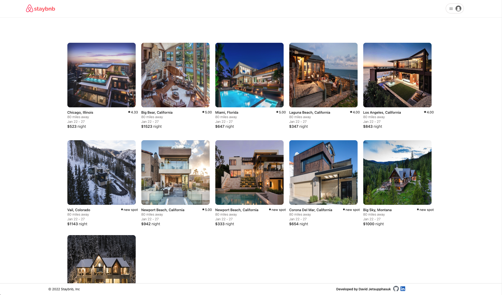

# Staybnb

Welcome to Staybnb, a clone of Airbnb.

<h3 align='center'>
 <a target='_blank' href="https://davids-airbnb-clone.herokuapp.com">» Check out the live site here «</a>
</h3>


## Technologies used:


## About the Project

[API Documentation](https://github.com/davidjettt/Airbnb-clone/wiki/API-Documentation)

[Database Schema](https://github.com/davidjettt/Airbnb-clone/raw/master/backend/airbnb-clone-db-schema-3.png)

[Features List](https://github.com/davidjettt/Airbnb-clone/wiki/Features-List)

[Redux State Shape](https://github.com/davidjettt/Airbnb-clone/wiki/Redux-State-Shape)

[Frontend Route](https://github.com/davidjettt/Airbnb-clone/wiki/Frontend-Routes)


## Challenges/Code Sample
```Javascript
function ImageRemoveBtn ({ spot, imgId, idx, images, previewImages, setImages, setPreviewImages, formType }) {
    const dispatch = useDispatch()

    # removes preview image when user is creating a spot
    const removeImg = () => {
        const imagesCopy = images.slice()
        const previewImagesCopy = previewImages.slice()
        previewImagesCopy.splice(idx, 1)
        imagesCopy.splice(idx, 1)

        setPreviewImages(previewImagesCopy)
        setImages(imagesCopy)
    }

    # removes preview image and deletes image when user is editing a spot
    const removeImgEditSpot = async () => {
        const data = await dispatch(deleteSpotImageThunk(imgId, spot))
        const imagesObj = []

        data.Images?.forEach(img => {
            imagesObj.push(img.url)
        })

        setPreviewImages(imagesObj)
    }

    return (
        
    )
}
```
When users are filling out the form to create a spot, they can upload images that is also displayed as a preview before the user submits their form. Each image has an 'X' on it, so users are able to remove an image.

To achieve this functionality, what I decided to do was store the preview images in an array and each preview image gets mapped out with this ImageRemoveBtn component with the unique identifier being the index. Once the 'X' button gets clicked the removeImg function will get triggered and a splice would be performed on the idx of the targeted preview image. Then setPreviewImages gets called to update state.

However, the removeImg function would not work if a user wanted to edit the images of a spot since removing a preview image would not delete the image from the database. So I decided to create another function, removeImgEditSpot, that gets triggered when a user is on the page for editing a spot. What this function is doing is calling an API to delete the targeted image and the data sent back is the rest of the images. So I extracted the image URLs, push them into an array, and updated state with that array.

I am proud of this code snippet because I had to really think outside of the box and utilize my debugging abilities and knowledge of React/Redux and how data flows in order to overcome this obstacle. Also, I think this component turned out pretty concise.


## App Screenshots

### Home Page


### Spot Details Page


### Trips Page


<!-- ## How to Launch Project

To launch project locally:
- `cd` into the backend folder.
- Create a `.env` file with environment variables:
    ```
    PORT=8000
    DB_FILE=db/dev.db
    JWT_SECRET=INSERT-PASSWORD-HERE
    JWT_EXPIRES_IN=604800
    ```
- Run `npm install` to install dependencies and then `npm start` to start the server.
- On a separate terminal, `cd` into the frontend folder.
- Run `npm install` and then `npm start` to launch application onto the browser at http://localhost:3000 -->
